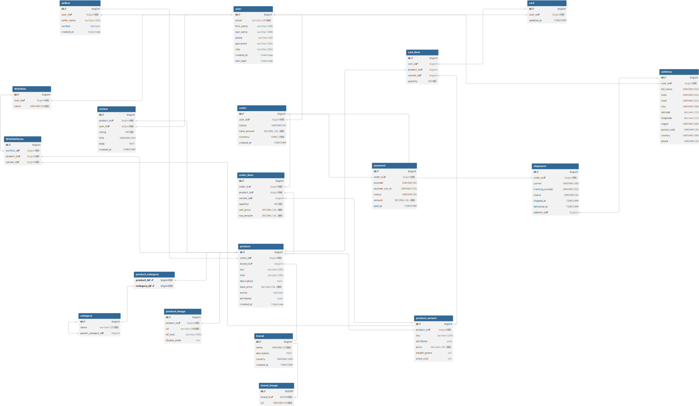

# E-Commerce Platform

A Backend e-commerce platform built with **Spring Boot** (backend) and **MySQL** as the primary database. The system includes authentication, role based access, product management, cart & wishlist handling, order processing, payment/shipping integration, and a clean modular architecture.

---

## Vote for this [project](https://roadmap.sh/projects/ecommerce-api) on roadmap.sh

## 🚀 Features

### **Backend (Spring Boot)**
- User authentication (Basic Auth / JWT depending on configuration)
- Role-based authorization (ADMIN / USER)
- Product CRUD with categories, brands, images
- Cart & Wishlist management
- Order creation, order items, shipping address
- Stripe payment integration (optional)
- Shipping integration (FedEx / DHL / Aramex ready structure)
- Global exception handling
- DTO-based clean API responses
- Pagination, filtering, and sorting
- Entity relationships modeled via JPA/Hibernate
- Soft-delete support for certain entities

---

## 🏗 Project Structure

### **Backend**
```
backend/
├── src/main/java/com/ecommerce/ecommerceplatform
│   ├── configuration/
│   ├── controller/
│   ├── dto/
│   ├── entity/
│   ├── exception/
│   ├── repository/
│   ├── security/
│   ├── service/
│   ├── utility/
│   └── EcommercePlatformApplication.java
└── src/main/resources/
    ├── application.properties
    └── Database/
```

## 🛢 Database Schema
Main entities:
- **User** & **Seller**
- **Product**
- **Category**
- **Brand** & **BrandImage**
- **ProductImage**
- **Cart** & **CartItem**
- **Wishlist** & **WishlistItem**
- **Order** & **OrderItem**
- **Address**
- **Payment**
- **Shipment**


Utility tables:
- **BlacklistedJWTToken** (optional — for JWT logout)

## 🛢 Database Conceptual Schema (ERD)


## 🛢 Database Logical Schema (Relational Mapping)
- **Check the responsive diagram [here](https://dbdiagram.io/d/ECommerce-Relational-Mapping-6930bac7d6676488ba7e438e)**
<br>
<br>
 

[//]: # (![ERD]&#40;src/main/resources/Database/ECommerce-Relational-Mapping.svg&#41;)

## 💲 Payment Gateway Integration (Stripe Gateway)

The platform uses **Stripe** to handle secure payments. Payments are processed via **PaymentIntents**, which ensure that the correct amount is charged and provide support for multiple payment methods. The flow is:

1. Backend creates a PaymentIntent for the order.
2. Frontend confirms the payment using Stripe.js.
3. Stripe calls a webhook to notify the backend about payment status.
4. Backend updates order status in the database.
5. A payout service runs in the background to transfer Sellers' Dues everyday at 02:00 AM automatically

- For local testing use Stripe CLI
  - Use the following commands to get the webhook secret
```CLI
stripe login
stripe listen --forward-to localhost:8080/api/stripe-webhook
```
- Update Your API Keys in `application.properties` file
```properties
stripe.secret.key=sk_test_51SacfWA..........
stripe.webhook.secret=whsec_9414ea..........
```
## 🚀 Caching (Redis Integration)

The platform uses **Redis** as a high-performance, in-memory caching layer to improve application speed and reduce database load.

### **Why Redis?**

Redis provides:

- ⚡ Ultra-fast read/write operations
- 🧠 In-memory key–value storage
- 🗄️ Automatic expiration (TTL) support
- 🔒 Secure session/token handling
- 🌐 Distributed and scalable architecture

This makes it ideal for caching frequently accessed data such as products, categories, and user-related information.

---

### **How Caching Works**

1. **Cache Lookup**  
   The system checks Redis for cached data using a dedicated key (e.g., `product:{id}`).

2. **Cache Hit**  
   If the value exists in Redis, it is returned immediately without querying the database.

3. **Cache Miss**  
   If not found:
  - The data is retrieved from the database.
  - The result is stored in Redis with a TTL (expiration time).
  - Future requests are served from the cached value.

---

### **Run Redis**
* Using Docker
```bash
docker run -p 6379:6379 --name redis -d redis 
```
* For other hosting platforms and more info see the [Redis documentation](https://redis.io/docs/latest/develop/)
### **Caching Example**

```java
@Cacheable(value = "product", key = "#id")
public Product getProduct(Long id) {
    /// Database call
}
```
## 🔧 Installation & Setup


### **Prerequisites**
- Docker


### **Steps**
1. Clone the project


4. Build and start the docker images:
```bash
docker compose up --build
```

## 💬 Contact
**Developer:** Mohamed Saad Abdel Ghaffar

