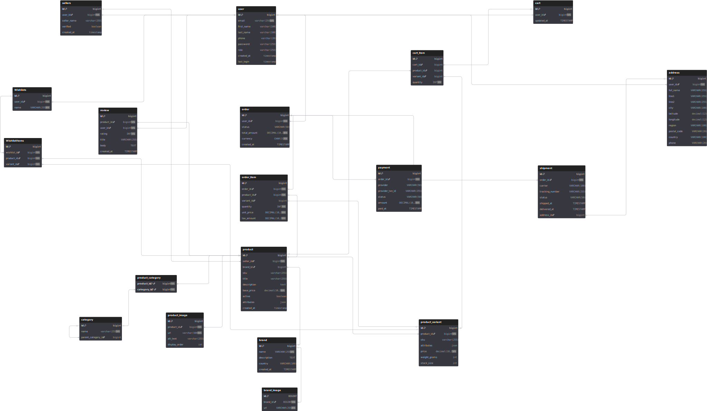

# E-Commerce Platform

A Backend e-commerce platform built with **Spring Boot** (backend) and **MySQL** as the primary database. The system includes authentication, role based access, product management, cart & wishlist handling, order processing, payment/shipping integration, and a clean modular architecture.

---

## 🚀 Features

### **Backend (Spring Boot)**
- User authentication (Basic Auth / JWT depending on configuration)
- Role-based authorization (ADMIN / USER)
- Product CRUD with categories, brands, images
- Cart & Wishlist management
- Order creation, order items, shipping address
- Stripe payment integration (optional)
- Shipping integration (FedEx / DHL / Aramex ready structure)
- Global exception handling
- DTO-based clean API responses
- Pagination, filtering, and sorting
- Entity relationships modeled via JPA/Hibernate
- Soft-delete support for certain entities

---

## 🏗 Project Structure

### **Backend**
```
backend/
├── src/main/java/com/ecommerce/ecommerceplatform
│   ├── configuration/
│   ├── controller/
│   ├── dto/
│   ├── entity/
│   ├── exception/
│   ├── repository/
│   ├── security/
│   ├── service/
│   ├── utility/
│   └── EcommercePlatformApplication.java
└── src/main/resources/
    ├── application.properties
    └── Database/
```

## 🛢 Database Schema
Main entities:
- **User** & **Seller**
- **Product**
- **Category**
- **Brand** & **BrandImage**
- **ProductImage**
- **Cart** & **CartItem**
- **Wishlist** & **WishlistItem**
- **Order** & **OrderItem**
- **Address**
- **Payment**
- **Shipment**


Utility tables:
- **BlacklistedJWTToken** (optional — for JWT logout)

## 🛢 Database Conceptual Schema (ERD)


## 🛢 Database Logical Schema (Relational Mapping)
- **Check the responsive diagram [here](https://dbdiagram.io/d/ECommerce-Relational-Mapping-6930bac7d6676488ba7e438e)**
<br>
<br>



## 🔧 Installation & Setup


### **Prerequisites**
- Java 17+
- Maven
- MySQL


### **Steps**
1. Clone the project
2. Create the database using [e-commerce-schema.sql](src/main/resources/Database/e-commerce-schema.sql):
```sql
create database if not exists `e-commerce`;
#.....
```
3. Configure `application.properties`:
```properties
spring.application.name=ECommercePlatform
spring.datasource.url=jdbc:mysql://localhost:3306/e-commerce
spring.datasource.username=root
spring.datasource.password=302123
product-image.upload-dir=E:/SpringBoot/ECommercePlatform/uploads

```
4. Start the backend:
```bash
mvn spring-boot:run
```

## 💬 Contact
**Developer:** Mohamed Saad Abdel Ghaffar

